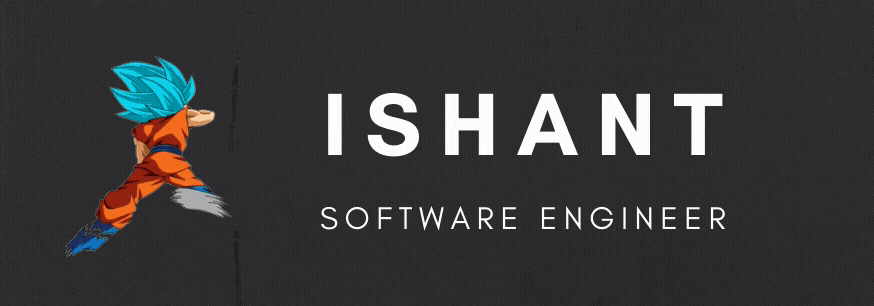

<!--
  POSTER NOTE:
  The image below uses an ABSOLUTE raw URL so it renders reliably on your
  profile (relative paths like ./poster.png often don't resolve until committed).
  Make sure poster.png is committed at the repo root.
  Your default branch is "master" — if it's "main", change /master/ to /main/ below.
-->

  

  

# Ahoy, I'm Ishant 👋

**Senior Full-Stack & Applied AI Engineer** (5+ yrs) ⚓ Building **LLM agents, fintech & distributed systems**. Powered by Go, Java, Python, TypeScript — and the Will of D. Currently **Principal Engineer & Tech Lead @ Dhanam Technologies**, shipping real-time trading platforms, agentic AI features, and low-latency infrastructure.

> 🏴‍☠️ *Minimal code, clean architecture, and the will to ship.*

---

## ⚡ What I'm Into
- 🤖 **AI / LLM Systems:** agentic workflows, MCP, RAG & context engineering, tool calling, LLM-as-judge evals, guardrails
- 🛠️ **Engineering:** full-stack products, distributed systems, low-latency trading, payments, cloud-native infra
- 📚 **Exploring:** agent orchestration, eval-driven LLM dev, model routing, consensus protocols (HotStuff / BFT)
- 🌊 **Vibes:** minimal code, clean architecture, and building products that scale

---

## 🛠 Languages & Tools

  

<i>+ LangChain · LangGraph · MCP · RAG · Vector DBs · TimescaleDB · OpenTelemetry</i>

---

## 📈 GitHub at a Glance

  
  

  

  

  

---

## 🏴‍☠️ Featured Projects
| Project | What it is | Links |
| --- | --- | --- |
| **FinVedas** | Real-time virtual trading & analytics platform (50K+ users) | [iOS](https://apps.apple.com/in/app/finvedas-virtual-trading-app/id6480355255) · [Android](https://play.google.com/store/apps/details?id=com.dhanamtechnologies.finvedas) |
| **BSE — Nivesh Mitra** | Investor-education & market-simulation app for the Bombay Stock Exchange | [iOS](https://apps.apple.com/in/app/nivesh-mitra/id6744709316) · [Android](https://play.google.com/store/apps/details?id=com.bseindia.nivesh_mitara) |
| **pipfi** | Share code instantly from VS Code (900+ users) | [Marketplace](https://marketplace.visualstudio.com/items?itemName=ishantgupta777.pipfi-code-share) · [Source](https://github.com/ishantgupta777/pipfi-code-share) |
| **Joplin** | Merged PRs to the open-source note app (Electron/React/TS) | [Contributions](https://github.com/laurent22/joplin/pulls?q=is%3Amerged+is%3Apr+author%3Aishantgupta777) |

---

## 💬 Dev Wisdom

  

---

## 🌐 Find Me

<!-- Enable once your site is live:

-->

  

<i>⚓ Powered by coffee and the Will of D.</i>

